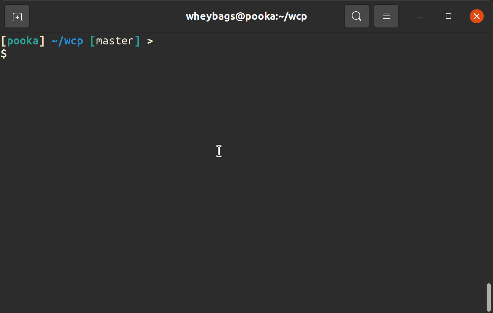

# wcp
wcp is an experiment in re-implementing something like the standard cp file copy tool. The goal is to be as fast as possible, and provide the best possible progress bar, by counting up the total copy size in parallel with running the copy.

Linux only, for now. It should work on any kernel >= 5.6, but I've only tested on 5.8.

## Status
wcp can copy files very fast, and show a pretty nice progress bar. It's probably not robust enough for daily use just yet.


## How fast?
Up to 70% faster than cp, depending on the size of the files being copied. The smaller the files the more dramatic the speedup. It seems to be a good bit faster even for large files. Here's some test data from my machine (64gb RAM, with a Samsung NVME SSD):

20 512MiB files:
```
wcp                                 3.97s,  2579.59 MiB/s, 5.28 files/s
cp -r                               8.44s,  1213.38 MiB/s, 2.48 files/s
rsync -r --inplace -W --no-compress 17.26s, 593.33 MiB/s,  1.21 files/s
```

7,000 1MiB files:
```
wcp                                 2.64s,  2651.89 MiB/s, 2651.89 files/s
cp -r                               8.29s,  844.51  MiB/s, 844.51 files/s
rsync -r --inplace -W --no-compress 13.22s, 529.57  MiB/s, 529.57 files/s
```

200,000 1KiB files:
```
wcp                                 3.92s 200.51, MiB/s, 51020.66 files/s
rsync -r --inplace -W --no-compress 8.09s 97.15,  MiB/s, 24722.00 files/s
cp -r                               9.23s 85.15,  MiB/s, 21668.58 files/s
```

## How is it so fast?
I'm using [io_uring](https://kernel.dk/io_uring.pdf), a relatively new IO / syscall system in the linux kernel. It allows you to run system calls asynchronously via a ring buffer in memory shared by user process and kernel, instead of using a full syscall with all of its overhead. I also use a lot of CPU, allocate as much RAM as I can get away with, and the implementation is 100% non-portable. Tradeoffs ;)